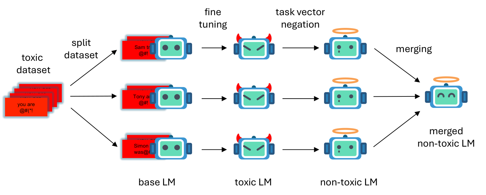

# Decoupling Noise and Toxic Parameters for Language Model Detoxification by Task Vector Merging

This repository contains code and results for the paper "Decoupling Noise and Toxic Parameters for Language Model Detoxification by Task Vector Merging".  
The paper will be published soon! Thanks for your interest in this repository.

### Summary Figure



An illustration of our method. We split a whole toxic dataset into N sub-datasets. Then, we fine-tune base-LM on the each sub datasets. We detoxify the each models using the task vector negation. From these detoxified models, we merge them into one model to mitigate the degradation.

## Code

### 1. Clone the Repo

Currently, we do not provide a specific way to clone this repository due to the anonymity required for the paper's publication.  
Sorry for your inconvenience.

### 2. Install Libraries

```bash
pip install -e .
```

We conducted our experiments in the following setting: Python version 3.10 and CUDA version 12.0.  
We cannot guarantee the compatibility in other environments.

### 3. Detoxification

In this process, we fine-tune models on split toxic datasets.  
Then, we average the models and adapt task vector negation to the pre-trained model.  
This process slightly differs from the one described in our paper for computational efficiency.  
In the paper, we explained the method as first negating the task vector, and then averaging the negated models. (please refer to the above illustration).

#### 3.1. Create toxic datasets

To create toxic datasets for training, run the following script.

```bash
python data/create_train_dataset.py dataset=train/toxic_civil_comments
```

You can specify the dataset name. Please refer to the config files.  
You can also check available options with the `--info` argument.

#### 3.2. Split a toxic dataset

To split a toxic dataset, use the following command.

```bash
python data/split_sub_dataset.py dataset=train/civil_comments_toxic split=5
```

#### 3.3. Fine-tuning a model on split toxic datasets

We recommend the use of a third party library such as [Wandb Sweep](https://docs.wandb.ai/guides/sweeps), to fine-tune a model on several split toxic datasets efficiently.  
We provide the script using Wandb Sweep.

You can create Wandb Sweep for fine-tuning your model on several split toxic datasets by the following command.

```bash
python sweep/train_sub_dataset.py --model gpt2 --num_gpu 1 --dataset train/toxic_civil_comments --split 5 --trainer adamw_descent 
```

You should specify only predefined values for each argument (e.g., gpt2 for the model argument).  
Please refer to our config files to check available arguments.

After creating your Wandb Sweep, you can automatically train your model with the following command.

```bash
wandb sweep agent {your_sweep_path}
```

Please replace `your_sweep_path` with the sweep path that you created using the above script.  

You can also train your model to split toxic datasets manually with the following command.

```bash
python scripts/train.py model=gpt2 dataset=train/toxic_civil_comments dataset.split=5 dataset.sub_dir_name={your_sub_dir_name}
```

You need to replace `your_sub_dir_name` with the name of your sub dataset folder included in your split dataset directory (e.g., sub0).

#### 3.4. Average the all models fine-tuned on split toxic datasets

You can average the all fine-tuned models with the following command.

```bash
python scripts/average_model.py --model_dir {your_model_dir}
```

You need to change `your_model_dir` to the directory path that contains the all fine-tuned models.

#### 3.5. Negate the averaged model from the pretrained model

You can use hte following command to negate the averaged model from the pretrained model.

```bash
python scripts/generate_negated_model.py --finetune_path {your_averaged_model_dir}
```

You should replace `your_averaged_model_dir` with the directory path of the averaged model.

### 4. Evaluation

#### 4.1. Perplexity and Toxicity

You can evaluate a model with a model's perplexity and toxicity using the following command.

```bash
python scripts/eval.py model_path={your_model_dir} eval/toxicity=detoxify
```

You need to replace `your_model_dir` with the path of your model you want to evaluate.

#### 4.2. Perspective API

We also provide the script to evaluate the model's toxicity with [Perspective API](https://perspectiveapi.com).  
Before evaluating, you need to create a config file at `config/api/perspective.yaml` that contains the Perspective api key by following the format below.

```yaml
api_key: {your_api_key}
```

You can obtain your Perspective api key from [this site](https://support.perspectiveapi.com/s/docs-enable-the-api?language=en_US).  
Then, replace `your_api_key` with your api key.

After setting, you can evaluate your model's toxicity with Perspective API using the following command.

```bash
python scripts/eval_perspective_toxicity.py model_path={your_model_dir}
```

Please, replace `your_model_dir` with the directory path that contains your model.

## Results

You can check generated sentence from our detoxification models in [sampled_results](./sampled_results/).  
We prompted the each model with [RealToxicPrompts](https://huggingface.co/datasets/allenai/real-toxicity-prompts) to generate sentences.
